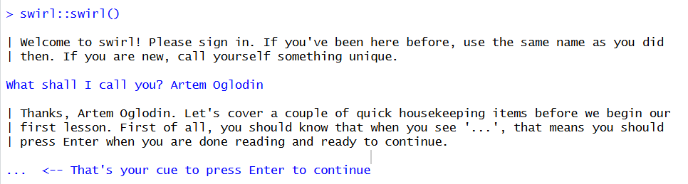

# Введение в R
artogal@yandex.ru

## Цель работы

1.  Развить практические навыки использования языка программирования R
    для обработки данных
2.  Развить навыки работы в Rstudio IDE:
    -   установка пакетов
    -   работа с проектами в Rstudio
    -   настройка и работа с Git
3.  Закрепить знания базовых типов данных языка R и простейших операций
    с ними

## Исходные данные

1.  Программное обеспечение Windows 10 Pro
2.  Rstudio Desktop
3.  Интерпретатор языка R 4.1
4.  Программный пакет swirl

## План

1.  Установить интерпретатор R и Rstudio IDE
2.  Установить программный пакет swirl:
3.  Запустить задание
4.  Запустить подкурсы и выполнить:
    1.  базовые структурные блоки (Basic Building Blocks)
    2.  рабочие пространства и файлы (Workspace and Files)
    3.  последовательности чисел (Sequences of Numbers)
    4.  векторы (Vectors)
    5.  пропущенные значения (Missing Values)
5.  Составить отчет и выложить его и исходный qmd/rmd файл в свой
    репозиторий Github

## Шаги:

### Шаг 1. Установка интерпритатора R и RStudio IDE

В данном шаге происходит установка и настройка рабочего окружения.

С сайта <https://posit.co/> скачиваем интерпритатор R и RStudio

*Рисунок 1.1 - установка интерпритатора R и RStudio*

### Шаг 2. Установка программного пакета swirl

Установка пакета swirl устанавливается внутри RStudio

*Рисунок 2.1 - установка программного пакета swirl*

### Шаг 3. Запуск задания

С помощью команты `swirl::swirl()` запускаем задание

*Рисунок 3.1 - запуск задания*

### Шаг 4. Подкурс Basic Building Blocks

In its simplest form, R can be used as an interactive calculator. Type
5 + 7 and press Enter.

    > 5 + 7

    [1] 12

To assign the result of 5 + 7 to a new variable called x, you type x \<-
5 + 7. This can be | read as ‘x gets 5 plus 7’. Give it a try now.

    > x <- 5 + 7

To view the contents of the variable x, just type x and press Enter. Try
it now.

    > x

    [1] 12

Now, store the result of x - 3 in a new variable called y.

    > y <- x-3

What is the value of y? Type y to find out.

    > y

    [1] 9

The easiest way to create a vector is with the c() function, which
stands for ‘concatenate’  
or ‘combine’. To create a vector containing the numbers 1.1, 9, and
3.14, type c(1.1, 9,  
3.14). Try it now and store the result in a variable called z.

    > z <- c(1.1, 9, 3.14)

Type z to view its contents. Notice that there are no commas separating
the values in the  
output.

    > z

    [1] 1.10 9.00 3.14

You can combine vectors to make a new vector. Create a new vector that
contains z, 555, then  
z again in that order. Don’t assign this vector to a new variable, so
that we can just see  
the result immediately.

    > c(z, 555, z)

    [1]   1.10   9.00   3.14 555.00   1.10   9.00   3.14

Numeric vectors can be used in arithmetic expressions. Type the
following to see what  
happens: z \* 2 + 100.

    > z * 2 + 100

    [1] 102.20 118.00 106.28

Take the square root of z - 1 and assign it to a new variable called
my_sqrt.

    > my_sqrt <- sqrt(z - 1)

Before we view the contents of the my_sqrt variable, what do you think
it contains?  
  
1: a vector of length 0 (i.e. an empty vector)  
2: a vector of length 3  
3: a single number (i.e a vector of length 1)

`Выбор: 2`

Perseverance, that’s the answer.  
Print the contents of my_sqrt.

    > my_sqrt

    [1] 0.3162278 2.8284271 1.4628739

Now, create a new variable called my_div that gets the value of z
divided by my_sqrt.

    > my_div <- z / my_sqrt

Which statement do you think is true?

1: my_div is undefined  
2: The first element of my_div is equal to the first element of z
divided by the first element of my_sqrt, and so on…  
3: my_div is a single number (i.e a vector of length 1)

`Выбор: 2`

All that hard work is paying off!  
Go ahead and print the contents of my_div.

    > my_div

    [1] 3.478505 3.181981 2.146460

To see another example of how this vector ‘recycling’ works, try adding
c(1, 2, 3, 4) and  
c(0, 10). Don’t worry about saving the result in a new variable.

    > c(1, 2, 3, 4) + c(0, 10)

    [1]  1 12  3 14

Try c(1, 2, 3, 4) + c(0, 10, 100) for an example.

    > c(1, 2, 3, 4) + c(0, 10, 100)

    [1]   1  12 103   4

In many programming environments, the up arrow will cycle through
previous commands. Try  
hitting the up arrow on your keyboard until you get to this command (z
\* 2 + 100), then  
change 100 to 1000 and hit Enter. If the up arrow doesn’t work for you,
just type the  
corrected command.

    > z * 2 + 1000

    [1] 1002.20 1018.00 1006.28

You can type the first two letters of the variable name, then hit the
Tab key (possibly more  
than once). Most programming environments will provide a list of
variables that you’ve  
created that begin with ‘my’. This is called auto-completion and can be
quite handy when you  
have many variables in your workspace. Give it a try. (If
auto-completion doesn’t work for  
you, just type my_div and press Enter.)

    > my_div

    [1] 3.478505 3.181981 2.146460

### Шаг 5. Подкурс Workspace and Files

In this lesson, you’ll learn how to examine your local workspace in R
and begin to explore  
the relationship between your workspace and the file system of your
machine.

Determine which directory your R session is using as its current working
directory using  
getwd().

    > getwd()

    [1] "C:/Users/artem/OneDrive/Документы/Threat-Hunting"

List all the objects in your local workspace using ls().

    > ls()

    character(0)

Assign 9 to x using x \<- 9.

    > x <-9

Now take a look at objects that are in your workspace using ls().

    > ls()

    [1] "x"

List all the files in your working directory using list.files() or
dir().

    > dir()

    [1] "lab1"                 "README.md"            "Threat-Hunting.Rproj"

As we go through this lesson, you should be examining the help page for
each new function.  
Check out the help page for list.files with the command ?list.files.

    > ?list.files

You are amazing!

Use the args() function to determine the arguments to list.files().

    > args(list.files)

    function (path = ".", pattern = NULL, all.files = FALSE, full.names = FALSE, 
        recursive = FALSE, ignore.case = FALSE, include.dirs = FALSE, 
        no.. = FALSE) 
    NULL

Assign the value of the current working directory to a variable called
“old.dir”.

    > old.dir <- getwd()

You are quite good my friend!

Use dir.create() to create a directory in the current working directory
called “testdir”.

    > dir.create("testdir")

Great job!

Set your working directory to “testdir” with the setwd() command.

    > setwd("testdir")

That’s correct!

Create a file in your working directory called “mytest.R” using the
file.create() function.

    > file.create("mytest.R")

    [1] TRUE

This should be the only file in this newly created directory. Let’s
check this by listing  
all the files in the current directory.

    > list.files()

    [1] "mytest.R"

Check to see if “mytest.R” exists in the working directory using the
file.exists() function.

    > file.exists("mytest.R")

    [1] TRUE

Access information about the file “mytest.R” by using file.info().

    > file.info("mytest.R")

             size isdir mode               mtime               ctime               atime exe uname
    mytest.R    0 FALSE  666 2025-10-02 10:58:34 2025-10-02 10:58:34 2025-10-02 10:58:34  no artem
                     udomain
    mytest.R LAPTOP-AMLGQMKH

Change the name of the file “mytest.R” to “mytest2.R” by using
file.rename().

    > file.rename("mytest.R", "mytest2.R")

    [1] TRUE

Make a copy of “mytest2.R” called “mytest3.R” using file.copy().

    > file.copy("mytest2.R", "mytest3.R")

    [1] TRUE

Provide the relative path to the file “mytest3.R” by using file.path().

    > file.path("mytest3.R")

    [1] "mytest3.R"

You can use file.path to construct file and directory paths that are
independent of the  
operating system your R code is running on. Pass ‘folder1’ and ‘folder2’
as arguments to  
file.path to make a platform-independent pathname.

    > file.path("folder1", "folder2")

    [1] "folder1/folder2"

Take a look at the documentation for dir.create by entering ?dir.create
. Notice the  
‘recursive’ argument. In order to create nested directories, ‘recursive’
must be set to  
TRUE.

    > ?dir.create

Create a directory in the current working directory called “testdir2”
and a subdirectory for  
it called “testdir3”, all in one command by using dir.create() and
file.path().

    > dir.create(file.path("testdir2", "testdir3"), recursive = TRUE)

Go back to your original working directory using setwd(). (Recall that
we created the  
variable old.dir with the full path for the orginal working directory at
the start of these  
questions.)

    > setwd(old.dir)

###Шаг 6. Подкурс Sequences of Numbers

The simplest way to create a sequence of numbers in R is by using the
`:` operator. Type  
1:20 to see how it works.

    > 1:20

    [1]  1  2  3  4  5  6  7  8  9 10 11 12 13 14 15 16 17 18 19 20

That gave us every integer between (and including) 1 and 20. We could
also use it to create  
a sequence of real numbers. For example, try pi:10.

    > pi:10

    [1] 3.141593 4.141593 5.141593 6.141593 7.141593 8.141593 9.141593

What happens if we do 15:1? Give it a try to find out.

    > 15:1

    [1] 15 14 13 12 11 10  9  8  7  6  5  4  3  2  1

Pull up the documentation for `:` now.

    > ?":"

You nailed it! Good job!

The most basic use of seq() does exactly the same thing as the `:`
operator. Try seq(1, 20)  
to see this.

    > seq(1, 20)

    [1]  1  2  3  4  5  6  7  8  9 10 11 12 13 14 15 16 17 18 19 20

This gives us the same output as 1:20. However, let’s say that instead
we want a vector of  
numbers ranging from 0 to 10, incremented by 0.5. seq(0, 10, by=0.5)
does just that. Try it  
out.

    > seq(0, 10, by = 0.5)

    [1]  0.0  0.5  1.0  1.5  2.0  2.5  3.0  3.5  4.0  4.5  5.0  5.5  6.0  6.5  7.0  7.5  8.0  8.5
    [19]  9.0  9.5 10.0

Or maybe we don’t care what the increment is and we just want a sequence
of 30 numbers  
between 5 and 10. seq(5, 10, length=30) does the trick. Give it a shot
now and store the  
result in a new variable called my_seq.

    > my_seq <- seq(5, 10, length=30)

To confirm that my_seq has length 30, we can use the length() function.
Try it now.

    > length(my_seq)

    [1] 30

There are several ways we could do this. One possibility is to combine
the `:` operator and  
the length() function like this: 1:length(my_seq). Give that a try.

    > 1:length(my_seq)

    [1]  1  2  3  4  5  6  7  8  9 10 11 12 13 14 15 16 17 18 19 20 21 22 23 24 25 26 27 28 29 30

Another option is to use seq(along.with = my_seq). Give that a try.

    > seq(along.with = my_seq)

    [1]  1  2  3  4  5  6  7  8  9 10 11 12 13 14 15 16 17 18 19 20 21 22 23 24 25 26 27 28 29 30

However, as is the case with many common tasks, R has a separate
built-in function for this  
purpose called seq_along(). Type seq_along(my_seq) to see it in action.

    > seq_along(my_seq)

    [1]  1  2  3  4  5  6  7  8  9 10 11 12 13 14 15 16 17 18 19 20 21 22 23 24 25 26 27 28 29 30

If we’re interested in creating a vector that contains 40 zeros, we can
use rep(0, times =  
40). Try it out.

    > rep(0, times = 40)

    [1] 0 0 0 0 0 0 0 0 0 0 0 0 0 0 0 0 0 0 0 0 0 0 0 0 0 0 0 0 0 0 0 0 0 0 0 0 0 0 0 0

If instead we want our vector to contain 10 repetitions of the vector
(0, 1, 2), we can do  
rep(c(0, 1, 2), times = 10). Go ahead.

    > rep(c(0, 1, 2), times = 10)

     [1] 0 1 2 0 1 2 0 1 2 0 1 2 0 1 2 0 1 2 0 1 2 0 1 2 0 1 2 0 1 2

Finally, let’s say that rather than repeating the vector (0, 1, 2) over
and over again, we  
want our vector to contain 10 zeros, then 10 ones, then 10 twos. We can
do this with the  
`each` argument. Try rep(c(0, 1, 2), each = 10).

    > rep(c(0, 1, 2), each = 10)

     [1] 0 0 0 0 0 0 0 0 0 0 1 1 1 1 1 1 1 1 1 1 2 2 2 2 2 2 2 2 2 2

## Оценка результата

В результате лабораторной работы мы определили IP-адрес злоумышленика.

## Вывод

Таким образом, мы научились анализировать предоставляемый файл и
находить ip-адрес злоумышленника.
